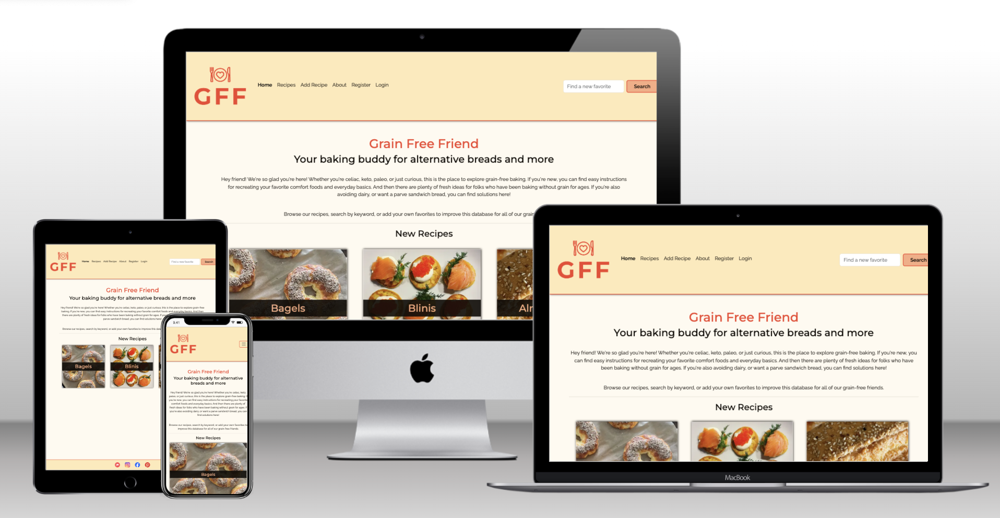
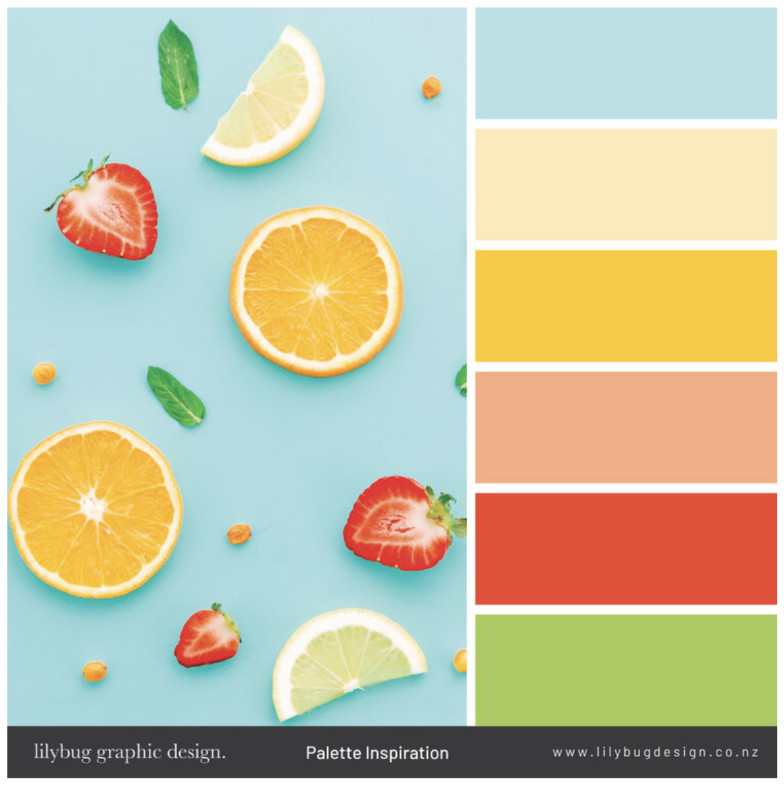
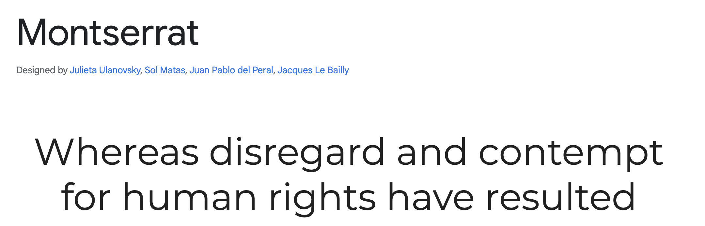
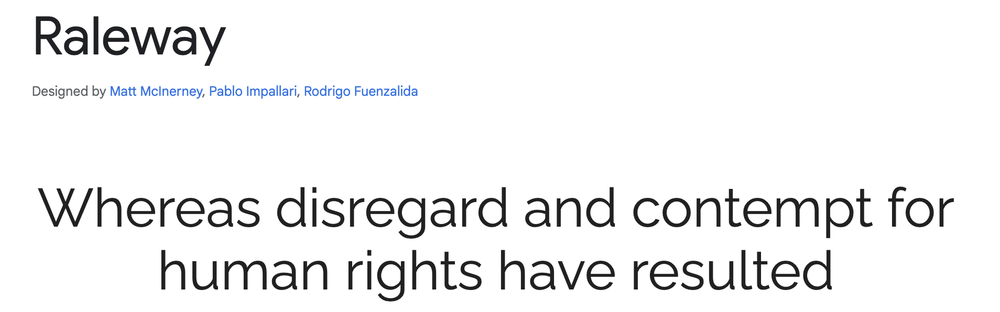

# Grain Free Friend
Your baking buddy for alternative breads and more

Grain Free Friend is a recipe sharing web app that invites home bakers to join a worldwide community for support and solutions. It was started in 2024 to share the secrets of baking without grain or sugar. GFF is a way to find the basic recipes that work every day, as well as fancy treats for special occasions.
 
This website is responsive on all devices, and designed to be appealing and intuitive. Users can search for and view recipes, and have the ability to create an account in order to access full CRUD functionality.

## Table of Contents
- [Intro](#grain-free-friend)
- [Table of Contents](#table-of-contents)
- [UX](#ux)
  - [User Personas](#user-personas)
  - [User Stories](#user-stories)
  - [Structure](#structure)
  - [Features](#features)
  - [Surface](#surface)
- [Testing](#testing)
- [Future Implementations](#future-implementations)
- [Languages, Libraries, and Software](#languages-libraries-and-software)
- [Deployment](#deployment)
- [Credits](#credits)

## UX
### User Personas
- A home cook who enjoys experimenting and wants to learn more about grain-free baking.
- A person with overlapping dietary restrictions (low-carb + kosher, vegan + celiac, etc).
- A person with new grain-free dietary restrictions who wants to find tasty substitute recipes efficiently.

### User Stories

These stories guided the development of features. To implement Agile methodology, they were mapped to Github Projects in a [kanban board](https://github.com/users/emilyrosenberg/projects/4/views/1) along with other development tasks. They are grouped into Milestones and tagged with priority labels.

- Account registration: As a Site User I can register an account so that I can add my own recipes, plus update and delete them.
- Manage user posts: As a Site User I can create, read, update and delete recipes within my account so that I can manage my contributions.
- Manage posts: As a Site Admin I can create, read, update and delete recipes so that I can manage my site content.
- Search by keyword: As a Site User I can search by keyword so that I can find recipes with specific ingredients, methods, etc.
- Open a recipe: As a Site User I can click on a recipe so that I can read the full text.
- View recipe list: As a Site User I can view a list of recipes so that I can select one to read.
- Find favorites: As a Site User I can use keywords to search for new favorites so that I can discover new recipes that suit me.
- Save favorites: As a Site User I can add and save favorites so that I can return to the site to see recipes that suit me.

### Structure
#### Landing Page
The landing page welcomes the user to GFF. It has information about the site and the GFF project, and shows three recently-added recipes. The header has a navbar and search bar, and there is a footer with social media links.

**Recipe Viewing:**  
#### All Recipes
This page shows all recipes on the site.
#### Recipe Detail
This page shows all the information about a single recipe, including title, description, level, method, and up to 3 tags, as well as a photo and the ingredients and instructions.

**Account Creation:**  
The user can create an account with a username and password. This functionality comes from allauth. They can then log in, log out, create, update, and delete recipes, plus add and view favorites.
#### Create an Account
This is a simple form from allauth to create a username and password, styled with crispy forms.
#### Login
This is a simple form from allauth to enter username/password.
#### Logout
This is a simple form from allauth to confirm logout by clicking a button.

**Recipe CRUD:**  
A logged-in user can:

- Create a new recipe
- Read posted recipes
- Update recipes they have posted
- Delete recipes they have posted

Feedback messages follow these user actions.

#### Add Recipe
This form was styled with crispy forms and allows the user to add a recipe to GFF. It includes input fields for Title, Description, Ingredients, Instructions, Level, Image, Image Description, Method, and at least one and up to three tags.
#### Update Recipe
The user sees the same form with their recipe information, and can make updates in any field.
#### Delete Recipe
The user can confirm that they want to delete the recipe.

**Favorites:**  
A logged-in user can:
- Save a recipe to their favorites

A feedback message accompanies this user action. For future implementations, please read more [here](#future-implementations).

#### Favorites
This page shows all the recipes that the user has added to their favorites.
#### Favorite Finder
A random recipe is pulled from all recipes. When the user searches by keyword, a recipe containing that keyword will be shown. They can then click the button to add it to their favorites.

**Other Pages:**  
#### About
The About page is all about Grain Free Friend's community and mission.
#### Contact
This is a future implementation. It will include a contact form.
#### 403 & 404
These pages exist and will become visible in a future implementation.

### Features
#### Header and Navigation
The header includes the GFF logo, navigation items, and a search bar.
- The logo is described [below](#logo).
- The navbar always contains Home, Recipes, and About. If the user is logged out or has no account, they can see options to Register and Login. If the user is logged in, they can see their Favorites, Add Recipe, and an option to Logout.
- The search bar has an input field and a button. User can search by keyword and results will be returned if the keyword is in any recipe's title, description, tags, ingredients, and instructions.
#### Footer
The footer contains social media links. Social media icons were created with [UXWing](https://uxwing.com/).

### Surface
#### Colors
The color palette is from [Lilybug Design](https://www.lilybugdesign.co.nz/colour-wall). I saw one of these designs used in a [PP4 project by Roshna Vakkee](https://github.com/RoshnaVakkeel/Little_Learners_Lab_Logs?tab=readme-ov-file), and found a beautiful one for my project. This palette is fresh and lively, as well as warm. It supports the Grain Free Friend branding: accessible, fun, warm, supportive.  

I used colorpicker to get the HEX tags for each color.  
Colors were picked with [imagecolorpicker.com](https://imagecolorpicker.com/en).  
Custom black and white were chosen from [Color Meanings](https://www.color-meanings.com/) to complement the colorful palette.

These colors are currently used on the site:
- Cream: #FFE9B8
- Peach: #F9AC82
- Red: #F1442E
- Black: #100C08
- White: #FFFAF0

#### Fonts
The fonts used in this project are implemented as a url from [Google Fonts](https://fonts.google.com/).  
The title font is [Montserrat](https://fonts.google.com/specimen/Montserrat). This is a bold, modern font with a rounded shape that's friendly and accessible. It was an option in the logo maker, and I decided to use it for the titles as well.  

The main font is [Raleway](https://fonts.google.com/specimen/Raleway). This is a friendly, readable font in a modern style. It makes the recipe ingredients and instructions very clear and accessible.  

#### Logo
The logo represents the joy of heartfelt baking for oneself or others. Trying unconventional baking methods can be intimidating, and I wanted to show that it can also be simple, an act of kindness and community. It's an open source icon with the initials of Grain Free Friend in Montserrat font. 
The logo image was created using the [wix.com logo maker](https://www.wix.com/logo/maker).  

#### Favicon
The favicon was created from the logo image using the [favico.io favicon converter](https://favicon.io/favicon-converter/).  

#### Images
The recipe images are either my personal photos or from [Unsplash](https://unsplash.com/).
 
They are stored in and accessed through [Cloudinary](https://cloudinary.com).

#### Background
The background is the lightest color in the palette, so that the content is clearly visible.

## Testing
Unfortunately technical testing is a future implementation.
#### Lighthouse
### Code Validation
#### HTML
#### CSS
#### Javascript
#### Python
### User Stories Testing
- _Account registration: As a Site User I can register an account so that I can add my own recipes, plus update and delete them._ 
The user can click on Register in the navbar to create an account with a username and password.
- _Manage user posts: As a Site User I can create, read, update and delete recipes within my account so that I can manage my contributions._ 
While logged in, the user can click on Add Recipe to add a recipe with a form. On the recipe detail page, they have the option of editing and deleting the recipe.
- _Manage posts: As a Site Admin I can create, read, update and delete recipes so that I can manage my site content._ 
The admin panel provides all of this functionality.
- _Search by keyword: As a Site User I can search by keyword so that I can find recipes with specific ingredients, methods, etc._ 
The search bar in the header allows the user to search for recipes by keyword.
- _Open a recipe: As a Site User I can click on a recipe so that I can read the full text._ 
The recipe detail page shows each recipe's title, description, level, method, and up to 3 tags, as well as a photo and the ingredients and instructions.
- _View recipe list: As a Site User I can view a list of recipes so that I can select one to read._ 
The recipes page shows all recipes on the site.
- _Find favorites: As a Site User I can use keywords to search for new favorites so that I can discover new recipes that suit me._ 
The favorite finder page allows logged-in users to see a random recipe or a recipe based on keywords.
- _Save favorites: As a Site User I can add and save favorites so that I can return to the site to see recipes that suit me._ 
In the favorites finder, a user can save a recipe to their favorites and view them on the Favorites page.
### Manual Testing
This web app was tested in Chrome Developer Tools for troubleshooting functionality and style problems during development. It was tested on iOS with Chrome and Safari. The UX design was tested by users.
### Bugs
- Missing imports  
The installed libraries would not run. The error message was: <i>Import "django_resized" could not be resolved.</i> The solution really was [to turn it off and on](https://stackoverflow.com/questions/65933570/import-boto3-could-not-be-resolved-python-vs-code). I restarted VS Code, and this fixed the bug.
- Add input field for levels  
The first time I tried to add an input field, the site would not run. I realized I needed to make migrations, which fixed the bug. I ran:  
`python3 manage.py makemigrations`  
`python3 manage.py migrate`
- Multi-select field  
I wanted to add something like tags to show the attributes of each recipe. It seemed like this would be possible with CheckboxSelectMultiple. I created the code but it did not work. I searched Stack Overflow, asked my fellow students, asked ChatGPT, and finally found out that I needed a later version of Django to run crispy forms, but only an earlier version could implement CheckboxSelectMultiple. Unfortunately I had to abandon the idea of a multi-select field. Instead I used 3 dropdown menus to list up to 3 attributes of the recipe. It is not the best UX, but they are searchable, and visible on each recipe card as if they are tags.
- Loading static files on the deployed site  
The static files wouldn't load, so I did some research and found [from Stack Overflow](https://stackoverflow.com/questions/28961177/heroku-static-files-not-loading-django) that I needed to install whitenoise. I installed whitenoise per [these instructions](https://devmaesters.com/blog/34). After I updated my requirements.txt, the files loaded.
- Adding a recipe to the Favorites page from the Favorite Finder.  
I created this site without a profile page, to simplify development. But when I got to this functionality for a logged-in user, it wasn't working according to the logic of the tutorial (which does include a profile, plus more search criteria). It seemed like I would have to create a new model, or make a lot of changes to the existing ones. It was necessary to:
  - Change the url from favorites to add_option.
  - Add the recipe pk to the form action.
  - Add pk to the parameters for post.
Error messages were still coming up. I found this [solution](https://docs.djangoproject.com/en/5.0/ref/models/instances/) and experimented with syntax, and was able to fix the bug and successfully add a recipe to favorites.

## Future Implementations
There are many features that will improve the user's experience of the current web app. 
- User can delete favorites. The CRUD functionality of the favorites app will be updated to include deleting favorites as well as adding them.
- User can add and delete favorites from the recipe detail page.
- User can comment on recipes. The comments will have CRUD functionality.
- User can filter a search by tag. This will also involve creating tags, instead of the placeholder fix in the current version.
- Require admin approval for user-submitted recipes and comments. the user can submit a recipe, and when it is approved, it will be published.
- Add contact form. As a placeholder, the Contact button on the About page currently links to Facebook's home page.
- Make custom 403 and 404 pages visible.
- Custom feedback messages.
- Update styling and visual appeal.
- Content. My grain-free recipe development project is ongoing.

## Languages, Libraries, and Software
### Languages
- HTML
- CSS
- Javascript
- Python
### Modules and Packages
- black (python formatter)
- cloudinary (image hosting)
- crispy-bootstrap5
- dj-database-url
- django-allauth (authorization package)
- django-cloudinary-storage
- django-crispy-forms (styles forms)
- django-resized (resizes a photo submitted in the form)
- django-richtextfield (allows markdown styling in input fields)
- gunicorn (server for WSGI applications)
- psycopg2
- whitenoise (allows static files to load in deployed app)
### Frameworks and Websites
- Bootstrap5
- Django
- Github
- Github projects [Kanban board here](https://github.com/users/emilyrosenberg/projects/4/views/1)
- Cloudinary
- PostgreSQL (ElephantSQL)
- Heroku
- VS Code
- Google Chrome Dev Tools
- Google Fonts
- Colorpicker
- UXWing
- Unsplash
- PEP8
- W3C - HTML
- W3C - CSS

## Creating the App
### Creating the Repo and Local Workspace
This app was created with Gitpod and developed in VS Code.
1. Go to the Code Institute Gitpod Full Template [Template](https://github.com/Code-Institute-Org/gitpod-full-template)
2. Click on Use This Template
3. Create a new repository with the template, and copy the url
Open VS Code and click Clone Git Repository and enter the url
4. Save the repository locally
5. Open a new terminal
6. Install Django and gunicorn: `pip3 install django gunicorn`
7. Install supporting database libraries dj_database_url and psycopg2 library: `pip3 install dj_database_url psycopg2`
8. Create file for requirements: in the terminal window type `pip freeze --local > requirements.txt`
9. Create project: in the terminal window type `django-admin startproject <your_project_name>`
10. Create app: in the terminal window type `python3 manage.py startapp <your_app_name>`
11. Add app to the list of installed apps in settings.py file: your_app_name
12. Migrate changes: in the terminal window type python3 manage.py migrate
13. Run the server to test if the app is installed, in the terminal window type `python3 manage.py runserver`
14. If the app has been installed correctly the window will display The install worked successfully! Congratulations! 
Additional instructions:
15. Create an account in ElephantSQL as a PostgreSQL database and connect in Heroku config vars and env.py
16. Create an account in Cloudinary for image storage and connect in Heroku config vars and settings.py

_Thanks to [Pedro Cristo](https://github.com/PedroCristo/portfolio_project_4/blob/main/README.md?plain=1) for the basis for these app creation instructions._

## Deployment
The web app was deployed with Heroku. It is live at this [link](https://grain-free-friend-d9004ed6c6b5.herokuapp.com/).  

### Heroku deployment
This site was deployed by completing the following steps:

1. Log in to [Heroku](https://id.heroku.com) or create an account
2. On the main page click the button labeled New in the top right corner and from the drop-down menu select Create New App
3. You must enter a unique app name
4. Select your region
5. Click on the Create App button
6. Click Resources and select Heroku Postgres database
7. Open the Settings tab and scroll down to Config Vars
8. Click Reveal Config Vars and add a new record with `SECRET_KEY = <key>`
9. Add a new record `CLOUDINARY_URL = <url>`
10. Add a new record `DISABLE_COLLECTSTATIC = 1`
11. Next, scroll down to the Buildpack section click Add Buildpack. Select Python and click Save Changes
12. Open the Deploy tab
13. Select Github as the deployment method
14. Confirm you want to connect to GitHub
15. Search for the repository name and click the connect button
16. Scroll to the bottom of the deploy page and select the preferred deployment type. Enable Automatic Deploys for automatic deployment when you push updates to Github
17. Create a Procfile `web: gunicorn <your_project_name>.wsgi`
For final deployment:
_NOTE: I could not deploy this way, unfortunately. A CI tutor told me that to deploy, I must have DEBUG = True in settings.py and DEBUG = FALSE in Heroku. A fellow student thought it might be a problem with the static files. I ran `python3 manage.py collectstatic` but this did not help either. Another CI tutor did troubleshooting with me and found a database error because Django is finding an earlier version of the database. I cannot recreate the error locally. When I try to run locally, I get Server Error (500). In settings.py DEBUG = False, and the app is running on Heroku. For now, this is the best I could do before submission._
18. When development is complete change the debug setting to: `DEBUG = False` in settings.py
19. In Heroku settings, delete the config vars for `DISABLE_COLLECTSTATIC = 1`, and `DEBUG = FALSE`

_Thanks to [Pedro Cristo](https://github.com/PedroCristo/portfolio_project_4/blob/main/README.md?plain=1) for the basis for these deployment instructions._

## Credits
### Content
- The content and branding of the site are designed to provide support and ideas for users who are interested in unconventional baking. The tone is warm and open, letting users know they are welcome and encouraging them to participate in the community.
- All recipe content is posted by users. The content that I have posted here is from my own grain-free recipe development project.
### Media
- The recipe images are either my personal photos or open source photos from [Unsplash](https://unsplash.com/).
- The social media icons are from [UXWing](https://uxwing.com/).
### Thank you
- This project was developed using the [Django Recipe Sharing tutorial by Dee Mc](https://www.youtube.com/watch?v=sBjbty691eI&list=PLXuTq6OsqZjbCSfiLNb2f1FOs8viArjWy&index=1). I am indebted to her for inspiration on the entire project, including the Django logic, the basic styling of the header, footer, and forms, the CRUD functionality of the recipes and favorites, class-based views, and querying.
- The project was also inspired by Code Institute's Django Blog Walkthrough. I used this to help create the success alerts.
- Inspiration for this readme came from [gStarhigh](https://github.com/gStarhigh/pro4). When I finish it I hope I can come anywhere close to this standard.
- An outline of the deployment instructions came from [Pedro Cristo](https://github.com/PedroCristo/portfolio_project_4/blob/main/README.md#frameworks---libraries---programs-used).
- Thank you to the Code Institute tutors for their enthusiastic support with problem solving and squashing bugs.
- Thank you to my Code Institute mentor Adegbenga Adeye.
- Thanks to my Code Institute cohort facilitator Kristyna, who is the best at pep talks. Also thanks for suggesting the recipe sharing tutorial by Dee Mc!
- And last but not least, thank you to my amazing student pals who have banded together to provide positivity and solutions in the tough times, and celebrations in the good ones.